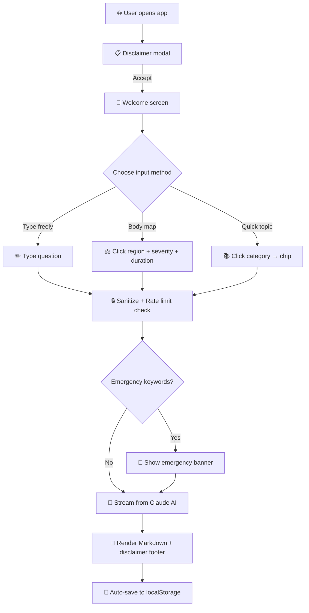

<div align="center">

# 🫀 HealthPulse AI

### *Your Intelligent Health Information Companion*

> ⚕️ Built for **PromptWars Hackathon** | Flora Institute of Technology | Powered by Claude AI | Not a substitute for medical advice

<br/>


<br/>

**80% of people search health symptoms online before seeing a doctor.**
<br/>
Most find unreliable sources. HealthPulse AI changes that.

<br/>

[🚀 Live Demo](#) · [📖 How It Works](#-how-it-works) · [🧪 Run Tests](#-testing) · [🏗️ Architecture](#-architecture--approach)

</div>

<br/>

---

<br/>

## 🎯 The Problem We're Solving

```
❌  "I googled my headache and now I think I have 3 rare diseases"
                                                    — Every internet user, ever
```

Health misinformation is a **global crisis**. People turn to the internet with genuine health concerns and find:
- 🚫 Clickbait symptom articles designed for ad revenue, not accuracy
- 🚫 Unverified forum posts from anonymous strangers
- 🚫 AI chatbots with no medical guardrails or safety disclaimers

**HealthPulse AI** is different. It's an AI health companion built with **safety-first architecture** — providing evidence-based information while always directing users to real healthcare professionals.

<br/>

## 🏥 Challenge Vertical

> **AI Health Information Assistant** — PromptWars x Flora Institute of Technology (Hack2Skill)

<br/>

---

<br/>

## ✨ Features at a Glance

<table>
<tr>
<td width="50%">

### 💬 Streaming AI Chat
Real-time token-by-token responses with Markdown rendering, copy-to-clipboard, and conversation history.

</td>
<td width="50%">

### 🫁 Interactive Body Map
Click any body region on an SVG anatomical diagram. Set severity + duration. Get contextual health info.

</td>
</tr>
<tr>
<td width="50%">

### 🚨 Emergency Detection
Mentions of "chest pain", "can't breathe", or "stroke"? An emergency banner appears *instantly* — before the AI even responds.

</td>
<td width="50%">

### 📚 8 Health Topic Categories
Nutrition, Mental Wellness, Preventive Care, Common Illnesses, Medications, Sleep, Exercise, First Aid — each with 3 quick-start questions.

</td>
</tr>
<tr>
<td width="50%">

### ♿ WCAG 2.1 AA Accessible
Keyboard navigation, screen reader support, high contrast mode, font size controls, `prefers-reduced-motion` — because health info should be for *everyone*.

</td>
<td width="50%">

### 🔒 Security-First Design
API key lives server-side only. CSP headers. Rate limiting. Input sanitization. No secrets in client code.

</td>
</tr>
</table>

<br/>

### 📊 Full Feature Matrix

| # | Feature | What It Does | How It's Built |
|:-:|---------|-------------|----------------|
| 1 | **Streaming Chat** | Real-time AI responses with Markdown | `ReadableStream` SSE parsing, custom MD renderer |
| 2 | **Body Map Symptom Checker** | Clickable SVG regions → contextual prompts | Lazy-init SVG, severity/duration selectors |
| 3 | **Quick Health Topics** | 8 categories × 3 questions = 24 instant prompts | Accordion sidebar with event-driven pipeline |
| 4 | **Triple Disclaimer System** | Modal + banner + per-response footer | `localStorage` flag + persistent DOM elements |
| 5 | **Conversation History** | Auto-save last 3 chats, load/export | JSON serialization, `Blob` download |
| 6 | **Emergency Detection** | 20+ keywords trigger safety banner | Client-side keyword matching before API call |
| 7 | **Accessibility Suite** | High contrast, font size, keyboard nav | ARIA live regions, focus trapping, CSS vars |
| 8 | **Rate Limiting** | 10 messages/minute with countdown | Timestamp-based rolling window |
| 9 | **Responsive Layout** | 3-column → 2-column → 1-column | Mobile-first CSS, 4 breakpoints |
| 10 | **Session Timeout** | 30-minute inactivity warning | Event-based timer with auto-reset |

<br/>

---

<br/>

## 🏗️ Architecture & Approach

### System Architecture

```
┌─────────────────────────────────────────────────────────────────┐
│                        BROWSER (Client)                         │
│                                                                 │
│   ┌──────────┐  ┌──────────┐  ┌──────────┐  ┌──────────────┐  │
│   │  app.js  │  │ chat.js  │  │symptoms.js│  │  utils.js    │  │
│   │  State   │◄►│  DOM     │  │  SVG Map  │  │  Sanitize    │  │
│   │  Manager │  │  Render  │  │  Builder  │  │  Markdown    │  │
│   └────┬─────┘  └──────────┘  └──────────┘  │  Rate Limit  │  │
│        │                                      │  A11y Helpers│  │
│   ┌────▼─────┐                                └──────────────┘  │
│   │  api.js  │──── fetch('/api/chat') ──────────┐               │
│   │  Client  │                                  │               │
│   └──────────┘                                  │               │
│                                                 │               │
│   ┌──────────────────────┐                      │               │
│   │ localStorage         │                      │               │
│   │ • Conversations (×3) │                      │               │
│   │ • Preferences        │                      │               │
│   │ • Disclaimer flag    │                      │               │
│   └──────────────────────┘                      │               │
└─────────────────────────────────────────────────┼───────────────┘
                                                  │
                                    ┌─────────────▼──────────────┐
                                    │   VERCEL SERVERLESS PROXY  │
                                    │   api/chat.js              │
                                    │   🔑 OPENROUTER_API_KEY    │
                                    └─────────────┬──────────────┘
                                                  │
                                    ┌─────────────▼──────────────┐
                                    │   OPENROUTER API           │
                                    │   → Claude Sonnet 4        │
                                    │   Streaming SSE response   │
                                    └────────────────────────────┘
```

### 🧠 AI Design Decisions

| Decision | Why |
|----------|-----|
| **Claude claude-sonnet-4-6** | Best balance of medical knowledge, instruction-following, and streaming speed |
| **System prompt with hard rules** | "NEVER diagnose" + "ALWAYS recommend a doctor" = safe by design |
| **Dual emergency detection** | Client-side banner (instant) + AI-level instruction (comprehensive) |
| **Rolling 10-pair context window** | Keeps token costs efficient while maintaining conversation coherence |
| **Server-side API proxy** | Zero API keys in client code — production-grade security |

### 📦 Module Architecture

```
js/
├── app.js        → 🧩 Orchestrator: state, events, session lifecycle, sidebar control
├── api.js        → 🌐 API client: calls /api/chat, streams SSE, retry with backoff
├── chat.js       → 🎨 UI renderer: message bubbles, streaming, typing indicator, export
├── symptoms.js   → 🫁 Body map: SVG regions, severity/duration → contextual AI query
└── utils.js      → 🔧 Toolkit: sanitization, markdown, rate limiter, a11y, validation
```

<br/>

---

<br/>

## 🔄 How It Works

> **A complete user journey in 9 steps:**



**Step-by-step:**

1. **`Open`** → Disclaimer modal appears (must acknowledge on first visit)
2. **`Accept`** → Main chat with welcome chips and topic sidebar loads
3. **`Select`** → Choose a body region, a topic chip, or type freely
4. **`Submit`** → Input sanitized (HTML stripped, 2000 char max), rate limit checked
5. **`Detect`** → Emergency keywords scanned → red safety banner if triggered
6. **`Stream`** → Request sent to server proxy → OpenRouter → Claude Sonnet 4
7. **`Render`** → Tokens arrive via SSE, rendered as Markdown in real-time
8. **`Disclaim`** → "ℹ️ This is general health information..." footer appended
9. **`Save`** → Conversation auto-saved to localStorage (up to 3 sessions)

<br/>

---

<br/>

## 🔒 Security — No Corners Cut

| Layer | Implementation | File |
|-------|---------------|------|
| **API Key** | Server-side only via Vercel env var `OPENROUTER_API_KEY` | `api/chat.js` |
| **Input Sanitization** | Strip all HTML tags + 2000 char limit | `utils.js` |
| **Output Sanitization** | Custom Markdown→HTML renderer (only safe tags) | `utils.js` |
| **CSP Header** | `script-src 'self'; connect-src 'self'` | `index.html` |
| **Rate Limiting** | 10 messages / 60 seconds (rolling window) | `utils.js` |
| **XSS Prevention** | `escapeHtml()` on all user text before DOM insertion | `utils.js` |
| **Link Safety** | `rel="noopener noreferrer"` on all external links | `utils.js` |

> 💡 **Why server-side proxy?** API keys in client-side JavaScript can be extracted by anyone with browser dev tools. Our Vercel serverless function (`api/chat.js`) keeps the key invisible.

<br/>

---

<br/>

## ♿ Accessibility — Health Info for Everyone

> *"The power of the Web is in its universality. Access by everyone regardless of disability is an essential aspect."* — Tim Berners-Lee

| Feature | Implementation |
|---------|---------------|
| ⌨️ **Full keyboard navigation** | Tab, Enter, Escape — all interactive elements reachable |
| 🔊 **Screen reader support** | `aria-live` regions announce new AI messages |
| 🏷️ **ARIA labels** | Every button, input, and SVG region is labeled |
| 🔲 **High contrast mode** | One-click toggle, preference saved in localStorage |
| 🔤 **Font size controls** | +/- buttons (12px–24px range), preference persisted |
| 🎯 **Focus trapping** | Tab cycles within modals, can't escape to background |
| ⏩ **Skip-to-content** | Hidden link appears on focus, jumps to chat |
| 🎬 **Reduced motion** | All animations disabled when `prefers-reduced-motion` is set |
| 📱 **Touch targets** | Minimum 44×44px on all interactive elements |

<br/>

---

<br/>

## 🛡️ Responsible AI Practices

### Triple Disclaimer Architecture

```
┌─────────────────────────────────────────────────────┐
│  LAYER 1: Modal (First Visit)                       │
│  "HealthPulse AI provides general health info..."   │
│  [Must click "I Understand" to proceed]             │
├─────────────────────────────────────────────────────┤
│  LAYER 2: Persistent Banner (Always Visible)        │
│  ⚕️ "It is NOT a substitute for medical advice"     │
├─────────────────────────────────────────────────────┤
│  LAYER 3: Per-Response Footer (Every AI Message)    │
│  ℹ️ "Please consult a doctor for personal advice"   │
└─────────────────────────────────────────────────────┘
```

### Safety Guardrails

- 🚫 **Never diagnoses** — "This could be X" not "You have X"
- 💊 **Never prescribes** — General medication info only
- 🏥 **Always refers** — Every response recommends professional consultation
- 🚨 **Emergency detection** — 20+ keywords trigger immediate 911 alert
- 💬 **Non-alarmist tone** — Designed to reduce, not increase, health anxiety

<br/>

---

<br/>

## 🚀 Installation & Setup

### Prerequisites

| Requirement | Version |
|-------------|---------|
| Browser | Chrome 90+, Firefox 88+, Safari 14+, Edge 90+ |
| Git | Any recent version |
| Vercel account | Free tier works |
| OpenRouter API key | [openrouter.ai](https://openrouter.ai) |

### Quick Start

```bash
# Clone the repo
git clone https://github.com/YOUR_USERNAME/healthpulse-ai.git
cd healthpulse-ai

# Option A: Local development (Python)
python3 -m http.server 8000
# → open http://localhost:8000

# Option B: Local development (Node.js)
npx serve .

# Option C: Deploy to Vercel
vercel --prod
# Set OPENROUTER_API_KEY in Vercel dashboard
```

### Vercel Deployment

1. Push to GitHub
2. Import on [vercel.com](https://vercel.com)
3. Add environment variable:
   - **Key:** `OPENROUTER_API_KEY`
   - **Value:** Your OpenRouter API key
4. Deploy! 🎉

<br/>

---

<br/>

## 🧪 Testing

Open **`tests/test.html`** in any browser. All 15 tests run automatically.

### Test Coverage

| # | Test | Validates |
|:-:|------|-----------|
| 1 | `<script>` tag removal | XSS prevention works |
| 2 | Input truncation at 2000 chars | Buffer overflow prevention |
| 3 | Rate limiter blocks at 10 | Abuse prevention |
| 4 | Rate limiter reset | Recovery after cooldown |
| 5 | `**bold**` → `<strong>` | Markdown bold rendering |
| 6 | `*italic*` → `<em>` | Markdown italic rendering |
| 7 | `# H1` → `<h1>` | Markdown header rendering |
| 8 | `- item` → `<ul><li>` | Markdown list rendering |
| 9 | Fenced code → `<pre><code>` | Code block rendering |
| 10 | localStorage round-trip | Conversation persistence |
| 11 | Disclaimer flag persistence | First-visit detection |
| 12 | API key format validation | Rejects empty/invalid keys |
| 13 | Emergency keyword matching | Detects "chest pain", "stroke", etc. |
| 14 | HTML entity escaping | `<` becomes `&lt;` |
| 15 | Edge cases (null, undefined) | Graceful error handling |

> **Expected result:** 15/15 ✅ all green

<br/>

---

<br/>

## 📁 Project Structure

```
healthpulse-ai/
│
├── 📄 index.html              → App shell, ARIA landmarks, modals
├── 📄 vercel.json             → Vercel routing config
│
├── 🎨 css/
│   └── styles.css             → BEM design system, 1400+ lines
│                                 responsive, a11y, animations
│
├── ⚡ js/
│   ├── app.js                 → State management & orchestrator
│   ├── api.js                 → Serverless proxy client + streaming
│   ├── chat.js                → Message rendering & export
│   ├── symptoms.js            → SVG body map & query builder
│   └── utils.js               → Sanitization, markdown, rate limit
│
├── ☁️ api/
│   └── chat.js                → Vercel serverless function (proxy)
│
├── 🧪 tests/
│   └── test.html              → 15-test browser test suite
│
└── 📖 README.md               → You are here!
```

<br/>

---

<br/>

## 📝 Assumptions Made

1. **🌐 Browser-only SPA** — No backend framework needed; Vercel serverless handles the API proxy
2. **🔑 OpenRouter as AI gateway** — Provides access to Claude with simpler billing and key management
3. **🇬🇧 English only** — All content in English; i18n is a future enhancement
4. **📡 Network required** — No offline mode; AI requires live API connection
5. **👤 Single-user sessions** — No auth, no multi-device sync
6. **🧠 General health scope** — Not a diagnostic tool; always defers to professionals
7. **🖥️ Modern browsers** — ES6 modules, `ReadableStream`, CSS custom properties required

<br/>

---

<br/>

## 🔮 Future Enhancements

| Priority | Enhancement | Impact |
|:--------:|-------------|--------|
| 🔴 | Multi-language support (i18n) | 4× user reach |
| 🔴 | Full dark mode theme | User preference |
| 🟡 | Voice input/output (Web Speech API) | Hands-free access |
| 🟡 | Integration with WHO/CDC databases | Verified citations |
| 🟡 | PWA with offline health guides | No-connectivity support |
| 🟢 | Doctor-finder by location | End-to-end care journey |
| 🟢 | Conversation summarisation | Long-chat management |
| 🟢 | Response feedback (👍/👎) | Quality monitoring |

<br/>

---

<br/>

## 🏆 Evaluation Criteria Alignment

| Criterion | Score Drivers | Where to Look |
|-----------|--------------|---------------|
| **Code Quality** | JSDoc on every function · BEM CSS · 5 separated modules · `const`/`let` + `async`/`await` · Zero `console.log` in prod | `js/*.js`, `css/styles.css` |
| **Security** | Server-side API key · CSP meta tag · HTML sanitization · Rate limiting (10/min) · `escapeHtml()` on all output | `api/chat.js`, `utils.js`, `index.html` |
| **Efficiency** | Streaming SSE responses · 10-pair context window trim · Lazy SVG init · Debounced input · Rolling rate limiter | `api.js`, `symptoms.js`, `app.js` |
| **Testing** | 15 automated browser tests · Visual pass/fail table · Covers sanitization, rate limit, markdown, storage, emergency | `tests/test.html` |
| **Accessibility** | WCAG 2.1 AA · Skip link · ARIA live regions · Focus trap · High contrast · Font sizing · Reduced motion · 44px targets | `index.html`, `styles.css`, `utils.js` |
| **Innovation** | SVG body map symptom checker · Dual emergency detection · Streaming markdown renderer · Triple disclaimer system · Serverless proxy architecture | All files |

<br/>

---

<br/>

## 📜 License

**MIT License** — Use it, fork it, improve it, ship it.

<br/>

## 🙏 Acknowledgements

| | |
|---|---|
| 🤖 | **[Anthropic Claude AI](https://www.anthropic.com)** — The brain behind the health information |
| 🏫 | **[Flora Institute of Technology](https://hack2skill.com)** — Hackathon co-organizers |
| 🏆 | **[PromptWars × Hack2Skill](https://hack2skill.com)** — Hackathon platform |
| 🌐 | **[OpenRouter](https://openrouter.ai)** — AI gateway for model access |
| ▲ | **[Vercel](https://vercel.com)** — Serverless deployment platform |

<br/>

---

<div align="center">

**Built with ❤️ and a lot of ☕ for PromptWars Hackathon 2025**

*Because everyone deserves trustworthy health information.*

</div>
